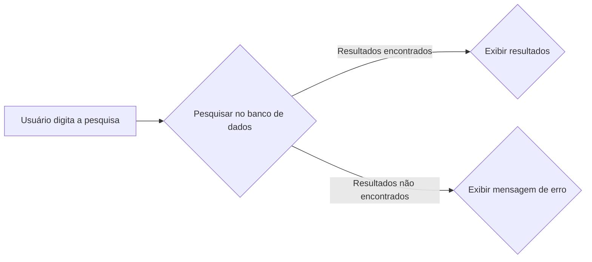

## Aplicação de Exercícios de Academia

**Descrição:**

Esta aplicação web simples permite que você pesquise por exercícios de academia, filtrando por nome ou grupo muscular. Os resultados da pesquisa são exibidos em uma lista clara e concisa, com links para vídeos demonstrativos.

**Tecnologias Utilizadas:**

* **HTML:** Estrutura da página.
* **CSS:** Estilização da página.
* **JavaScript:** Lógica da aplicação, incluindo a pesquisa e a exibição dos resultados.

**Como Usar:**

1. Digite o nome do exercício ou grupo muscular no campo de pesquisa.
2. Clique no botão "Pesquisar".
3. Os resultados serão exibidos abaixo do campo de pesquisa.

**Funcionalidades:**

* **Pesquisa por texto:** Pesquise por palavras-chave nos títulos, descrições e tags dos exercícios.
* **Exibição de resultados:** Os resultados da pesquisa são apresentados em uma lista, com o título, descrição e link para o vídeo.

**Próximos Passos:**

* **Melhorias de desempenho:** Implementar técnicas como cachear elementos do DOM e utilizar `DocumentFragment`.
* **Melhorias na interface do usuário:** Adicionar feedback visual, highlighting, sugestões de pesquisa e outros recursos.
* **Funcionalidades adicionais:** Implementar filtros, favoritos, histórico de pesquisas e outras funcionalidades úteis.
* **Acessibilidade:** Garantir que a aplicação seja acessível a todos os usuários, utilizando atributos ARIA e outras técnicas.

**Contribuições:**

Contribuições são bem-vindas! Se você encontrar algum bug ou tiver alguma sugestão de melhoria, por favor, abra um issue ou faça um pull request.

**Agradecimentos:**

Agradeço à Alura e ao Gemini AI pela oportunidade de aprender e desenvolver esta aplicação.

**Observação:** Para uma análise mais detalhada do seu código e sugestões mais específicas, por favor, forneça o conteúdo do arquivo `dados.js` e qualquer outra informação relevante sobre a estrutura do seu projeto.

---

**Recursos Adicionais:**

* **Diagrama de Fluxo:** [Incluir um diagrama de fluxo simplificado da aplicação, se disponível]
* **Imagens:** [Incluir imagens da interface da aplicação, se disponíveis]

**Considerações:**

* **Estrutura:** Utilize o Markdown para formatar o texto, como listas, títulos e código.
* **Clareza:** Explique as funcionalidades de forma clara e concisa.
* **Concisão:** Mantenha o README conciso e fácil de entender.
* **Atualizações:** Mantenha o README atualizado à medida que a aplicação evolui.

**Exemplo de Diagrama de Fluxo (simplificado):**

**Exemplo de Imagem:**
[Incluir uma imagem da interface da aplicação, por exemplo, um screenshot da página principal]

**Dicas:**

* Utilize ferramentas como o GitHub Markdown Guide para aprender mais sobre a sintaxe do Markdown.
* Crie um README claro e conciso para ajudar outros desenvolvedores a entender a sua aplicação.
* Mantenha o README atualizado para que ele reflita o estado atual da sua aplicação.

**Com este README bem estruturado, você estará facilitando a colaboração e o entendimento da sua aplicação por outros desenvolvedores.**

**Gostaria de adicionar mais alguma coisa ou tem alguma outra pergunta?** 

**Observação:** Para uma análise mais detalhada do seu código e sugestões mais específicas, por favor, forneça o conteúdo do arquivo `dados.js` e qualquer outra informação relevante sobre a estrutura do seu projeto.

**Este README oferece uma base sólida para o seu projeto. Adapte-o às suas necessidades específicas e adicione mais detalhes para torná-lo ainda mais completo.**

O link do projeto versionado: https://projeto-alura-gemini-omega.vercel.app/
